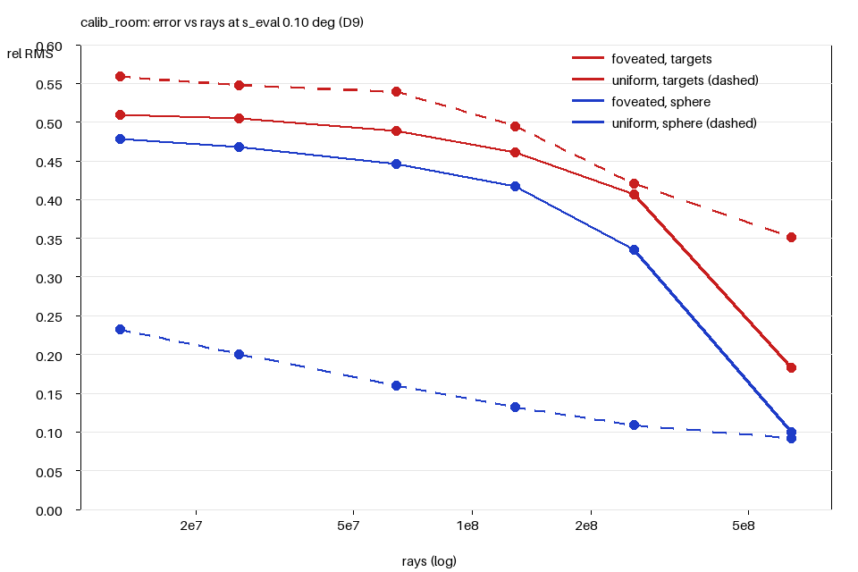
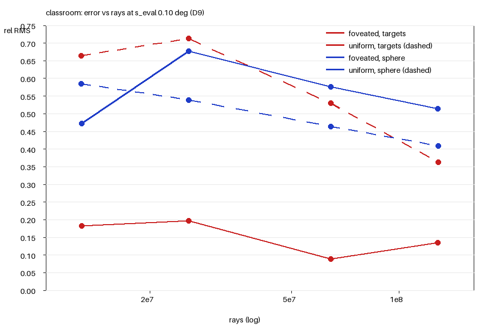

# Phase A result — error versus budget, foveated against uniform

One page. Everything measured on the workstation (Blender 5.2.1, OptiX, RTX 4090) on
2026-09-13 unless marked assumed. Metric D9: the representation reconstructed at s_eval = 2 s0
and compared to the reference box-filtered to s_eval; relative RMS, solid-angle weighted.
Foveated (F) is the fixation sequence integrated finest-owns; uniform (U) is an equirect
render at 64 spp whose width gives the same number of rays, upsampled to the reference grid
and filtered the same way. Targets are cells within 1 deg of the 50 calibration targets, or
of the Classroom's 10 gaze centres; "fixated" counts only the targets whose fixation is
among the first K, so at K = 50 (or 10) the two columns coincide. The sphere figure for F is over the part it covers, with
the uncovered fraction beside it.

Small-profile charts: `reference/a5_curve_calib_room_small.png`, `reference/a5_curve_classroom_small.png`.

## Calibration room, 50 targets

| K | small: rays | fixated F / U | all tgt F / U | sphere F (uncov) / U | full: rays | fixated F / U | all tgt F / U | sphere F (uncov) / U | F s | U s |
|---|---|---|---|---|---|---|---|---|---|---|
| 1 | 0.80 M | 0.075 / 0.447 | 0.292 / 0.347 | 0.546 (0.87) / 0.296 | 12.9 M | 0.146 / 0.365 | 0.509 / 0.559 | 0.478 (0.87) / 0.232 | 0.14 | 0.51 |
| 2 | 1.60 M | 0.107 / 0.370 | 0.284 / 0.323 | 0.535 (0.85) / 0.280 | 25.7 M | 0.143 / 0.385 | 0.504 / 0.548 | 0.468 (0.85) / 0.201 | 0.28 | 0.62 |
| 5 | 4.00 M | 0.092 / 0.272 | 0.276 / 0.315 | 0.524 (0.84) / 0.251 | 64.3 M | 0.148 / 0.411 | 0.489 / 0.539 | 0.446 (0.84) / 0.160 | 0.70 | 0.97 |
| 10 | 7.99 M | 0.143 / 0.282 | 0.261 / 0.300 | 0.503 (0.82) / 0.227 | 128.7 M | 0.166 / 0.469 | 0.461 / 0.495 | 0.417 (0.82) / 0.132 | 1.40 | 1.67 |
| 20 | 15.99 M | 0.157 / 0.291 | 0.240 / 0.302 | 0.428 (0.78) / 0.194 | 257.4 M | 0.173 / 0.423 | 0.406 / 0.420 | 0.335 (0.78) / 0.109 | 2.79 | 2.93 |
| 50 | 39.97 M | 0.161 / 0.294 | 0.161 / 0.294 | 0.140 (0.42) / 0.151 | 643.4 M | 0.183 / 0.351 | 0.183 / 0.351 | 0.100 (0.42) / 0.092 | 7.00 | 7.34 |

Seconds are for the full profile: F is the sum of seed-0 render calls (0.140 s per fixation,
warm-up 0.46 s excluded), U is preview360's timer (includes the EXR write). Uniform widths at
full: 634, 896, 1418, 2006, 2836, 4484.

## Classroom, 10 gazes

| K | small: rays | fixated F / U | all tgt F / U | sphere F (uncov) / U | full: rays | fixated F / U | all tgt F / U | sphere F (uncov) / U | F s | U s |
|---|---|---|---|---|---|---|---|---|---|---|
| 1 | 0.80 M | 0.292 / 0.906 | 0.282 / 0.904 | 0.564 (0.87) / 0.764 | 12.9 M | 0.234 / 0.800 | 0.183 / 0.665 | 0.472 (0.87) / 0.585 | 0.17 | 0.94 |
| 2 | 1.60 M | 0.159 / 0.350 | 0.279 / 0.879 | 0.708 (0.81) / 0.663 | 25.7 M | 0.102 / 0.399 | 0.197 / 0.713 | 0.677 (0.81) / 0.539 | 0.34 | 1.14 |
| 5 | 4.00 M | 0.130 / 0.303 | 0.149 / 0.816 | 0.577 (0.64) / 0.579 | 64.3 M | 0.075 / 0.228 | 0.089 / 0.529 | 0.576 (0.64) / 0.464 | 0.82 | 1.65 |
| 10 | 7.99 M | 0.152 / 0.759 | 0.152 / 0.759 | 0.520 (0.31) / 0.516 | 128.7 M | 0.134 / 0.363 | 0.134 / 0.363 | 0.514 (0.32) / 0.409 | 1.65 | 2.65 |

## What it says

**At the targets foveation wins at every budget, on both scenes and both profiles**: 1.8x
and 1.9x on the calibration room at K = 50 (small, full), 5x and 2.7x on the Classroom at
K = 10. On the targets actually fixated the margin is there from the first fixation: at the
full profile the calibration room's fixated targets score 0.146 against uniform's 0.365 at
K = 1 and 0.183 against 0.351 at K = 50; on the Classroom 0.075 against 0.228 at K = 5.
**Over the sphere uniform wins at every budget below the largest**, by 2x to 3x on the
calibration room, and at the largest budget the two are level (small: F 0.140 on its covered
58% against U 0.151; full: 0.100 against 0.092; Classroom full K = 10: 0.514 against 0.409,
uniform).

The mechanism, measured. Uniform saturates at the targets: from 2006 to 4484 px at full its
target error only moves from 0.495 to 0.351, towards the off-grid floor of 0.226, because
its pixels are not on the reference grid and the Siemens-star cards charge every
misregistration; foveation puts 0.05 deg samples there, four per s_eval cell, and averages
that down to 0.183. Foveation does not cover the sphere: one fixation covers 13% of it, fifty
cover 58%, and what it covers between fixations is periphery with 0.5 to 1.2 deg footprints,
charged for their blur at s_eval, which is where uniform's evenly spread rays win.

## Floors and checks

Resampling floor at s_eval, from the reference re-rendered half a pixel of yaw off-grid
(seed 1, both renders' noise subtracted in quadrature): calibration room 0.175 targets /
0.065 sphere at small, 0.226 / 0.051 at full; Classroom 0.375 / 0.131 and 0.257 / 0.107. The
bilinear half-pixel shift used before gave 0.217 / 0.089, 0.300 / 0.070, 0.368 / 0.222 and
0.243 / 0.215: it is also a 2x2 blur, and overstated the sphere floor by up to 2x.

The metric charges a uniform render at the reference resolution 1.03x (small, 64 spp) and
1.01x (full, 256 spp) its own seed-pair noise at s_eval: nothing but noise when there is
nothing but noise. Identity of the reconstruction path is exact (4e-16) to 60 deg of
latitude. The 90 deg control is 3.7x and 4.2x the K = 50 target error on the calibration
room and 8.8x and 11.5x on the Classroom, against a 3x threshold. The per-cell D8
validation is closed as a question (2026-09-13, fourth pass). Its binned (b) criterion is now
judged on plain-content targets only (calibration room: the wire targets; Classroom: gazes
whose binned alignment floor is below 0.03), textured targets being reported as
registration-limited. At the small profile the wires pass 8 of 8 and the Classroom 5 of 7
(the two failures are the floor under the desks and a window gaze that sees the world
background through the panes). At the full profile the wires score 0.006 to 0.013 against
bounds of 0.004 to 0.009, and the cause is measured, not radiometric: the brightness ratio
fixation over reference is 1.000 +- 0.003 on all eight, the seed-1 render gives the same
statistic against the reference as seed 0 while the seed pair's own noise is 0.003, and a
one-pixel shift of the reference reproduces the level; the sample lattice against the
0.5 deg cell grid at sub-pixel scale, which the bound's half-pixel floor under-represents
once the foveal spacing has grown to two pixels at 2 deg. What the validation was for is
established by three other measurements: the calibration ratio (the metric charges a
grid-aligned render 1.01x to 1.03x its own noise), the brightness ratio, and check (a) (the
record's directions agree with the Position pass to 0.018 reference pixels at both profiles).

## The warp parameters

The A6 sweep (`a6-warp-sweep.md`, calibration room, small profile) at equal rays: E2 4 gives
the lowest fixated-target error (0.103 against 0.155 at E2 2 and 0.227 at E2 1) and E2 1 the
lowest covered-sphere error (0.203 on 58% covered against 0.435 on 22%); e_max 45 wins the
targets, 30 the sphere. A larger E2 buys foveal accuracy per ray, a smaller one buys
coverage; the profiles keep E2 = 2, e_max = 45 until the objective picks (D11).

## Assumed

- The noise subtracted from the floor is A2's tile median at 1024 spp halved for the s_eval
  box (1/sqrt(4)); it is 0.009 to 0.022 against floors of 0.05 to 0.38.
- Uniform seconds include the EXR write; a few ms to 1.6 s at these sizes.
- The 91% lattice coverage of an area-equivalent disc (the 81%-of-cap figure is measured).

## Untested

- Any gaze order other than target order, and any gaze policy (Phase C).
- Error on distance; only radiance is compared.
- Budgets above 50 fixations, and whether the covered-sphere error keeps falling.
- Anything binocular (Phase B).
